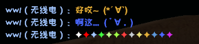

#CSGOConsoleTools
### 一个通过游戏启动行的远程控制台来远程操作游戏控制台,发送特定指令的工具.
##已实现功能:
| 效果 | 注释 |
|------|-----|
| 自定义无线电|  |
| 游戏内播放音乐 | 通过游戏内loopback实现,通过SoX对音乐进行编码|
| 游戏内调用网易云播放音乐 |同上,但是使用了公开API进行了搜索,可以自己或者让队友点歌 |
| 主菜单内播放背景音乐 | 使用了JLayer进行MP3的播放,通过控制台捕捉特定文字来开始或停止播放 |
| ~~自动骂人~~ | 不推荐使用! 可能导致被聊天封禁! 仅为娱乐使用 |
| 发送模拟开箱 | 通过Random使用网上公开的出货几率进行随机,仅供娱乐|
| 自动报血 | 通过控制台玩家死亡时输出的血量进行格式化,在队伍信息中自动发送 |
| 自动修改启动行与无线电文件 | 可以自动对启动行进行修改 |
| 自定义无线电预览 | 可以预览无线电在游戏中发出后是什么效果 |
##视频预览
如无法加载,可以查看img文件夹下的[preview.mkv](img/preview.mkv)
